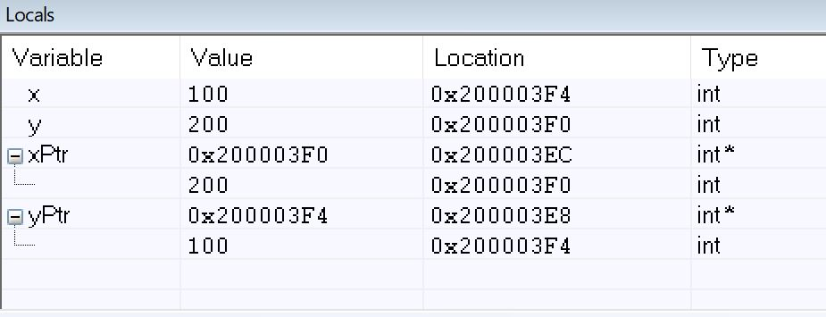

1. in order to setup the input arguments, "main" function first stores value of x to R0, then push it to the stack; then it stores the value of y to R0, and push it to the stack. After all that, it gets the address where value of y is being stored from the stack, and store it in R0, then push it to the stack. it gets the address where value of x is being stored from the stack, and store it in R0, then push it to the stack.
2. R0 = 0x200003EC, R1 = 0x200003E8
3. 